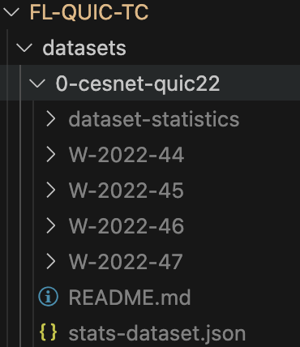

# QUIC Network Traffic Flow Classification with Federated Learning

This is the supporting page for the MSc thesis titled, "QUIC Network Traffic Classification Using Federated Learning".

The thesis presents a methodology for processing and classifying QUIC network traffic flows with Federated Learning under a realworld non-IID dataset. 

In line with principles of reproducibility and transparency, and to support open science, the scripts utilized in the experiments are available to the public. The dataset generated for this research is also accessible. These resources aim to aid a more comprehensive understanding of the methodologies employed and foster additional research in this field.

## Before reproducing

### Dataset

 The project used the [CESNET-QUIC22](https://zenodo.org/records/7963302) realworld dataset. For using it, download the [zip](https://zenodo.org/records/7963302#:~:text=Download%20all-,cesnet%2Dquic22.zip,-md5%3A2d52ad44ddb22645a3464634fc54bb9c) file, unzip it, rename the root folder to 0-cesnet-quic22 and put it into ~/datasets/0-cesnet-quic22. The folder should look like this:
 
 

### Organization mapping

 Reproducing the dataset requires the *prefixes-orgs.csv* file which maps the flows IP address to a organizational ID. However, for privacy reasons this is not public. If you want to reproduce this dataset, please contact the authors! If you don't have the mapping, the methodology will use random IDs for each flow record.

### Configuration

 The [configuration.py](configuration.py) holds the static key values used in multiple notebooks and files. It is important to set the *self._path_home* variable to the exact path to this projects root folder (*FL-QUIC-TC*) as everything save/load/read/write handled relative to this path. 

## Repository Structure
In our repository, the files and notebooks are organized as follows:
 - [datasets](datasets): Folder for the 
     - 0-cesnet-quic22: Home folder for the dataset. Please download it, unzip it and put it here while renaming its root folder to 0-cesnet-quic22.
     - 1-filtered: Daily datasets only with target application labels and organizations ID.
     - 2-eval: Expand and save the PPI and histogram features into multiple columns.
     - 3-features: Calculate additionaly features: SUBPSTATS, SUBFLOWSTATS
     - 4-dataset: The time sorted datasets: full dataset (*dataset.parquet*), dataset per clients (*org-{client_id}.parquet*) and the chunkified CL dataset under CL/.
     - 5-federated: Federated data chunks for each scenario.
 - [results](results)
   - class_labeling: Holds the class to ID mappings, which are resulted from label encoding.
   - global_models: Holds each global models aggregated after each FL rounds for each FL scenarios.
   - scenarios: Holds the results for each scenario
     - CL: Hold the results for each central learning scenario
 - [1-prepare-dataset.ipynb](1-prepare-dataset.ipynb): This notebook creates the CL data and FL scenarios data chunks in 5-steps from the CESNET-QUIC22 dataset. Step-1 requires the *prefixes-orgs.csv*.
 - [2-dataset-visualization.ipynb](2-dataset-visualization.ipynb): Visualizes the important features of the created dataset, such as traffic distribution between clients, apps and clients+apps. Uses data from /datasets/4-dataset.
 - [3-central-learning.ipynb](3-central-learning.ipynb): In this notebook, one can execute the CL pipeline with selected features. The scenarios and their features used in the thesis are already written in the code as a dict (*CL_CASE_FEATURES*). As a result, it executes a CL and then creates and saves its results.
 - [4-shap.ipynb](4-shap.ipynb): In this notebook, one can choose a CL scenario and analyse it with SHAP. As a result, it will create a SHAP diagram for the top 20 most influental feature.
 - [5-federated-learning.ipynb](5-federated-learning.ipynb): Executes a FL scenario on a choosen FL dataset with the choosen aggregation algos. While it executes the FL, it exports the results after every round 
 - [6-federated-visualizations.ipynb](6-federated-visualizations): Visualizes the overall comparison of the executed aggregation algos performance as well as the groupped client F1-scores used for the thesis. 
 - [configuration.py](configuration.py): Describes the Configuration utility class which holds key static parameters. The most important is the _path_home variable, don't forget to set it to your "*FL-QUIC-TC*" folder's full path. The thesis results achieved by the given values. 
 - [federated_clients.py](federated_clients.py): Describes the FederatedClient class which used as a client instance in the Flower federated learning.
 - [federated_metrics.py](federated_metrics.py): Describes the MetricsTracker class and other helpful functions for metric collection, calculation and visualization. 
 - [model.py](model.py). Describes the used PyTorch model fully-connected neural network architecture.
 - [prefixes-orgs.csv](prefixes-orgs.csv): IP prefix - Organizations mapping. Not publicly included as it is not public. Contact the authors please if you want to reproduce the dataset.
 - [.gitignore](.gitignore): Ignore huge files and the private mapping file in git.
 - [requirements.txt](requirements.txt): The exact python libraries and their versions used originally. Created and exported from project's virtual python environment via "*pip freeze > requirements.txt*".